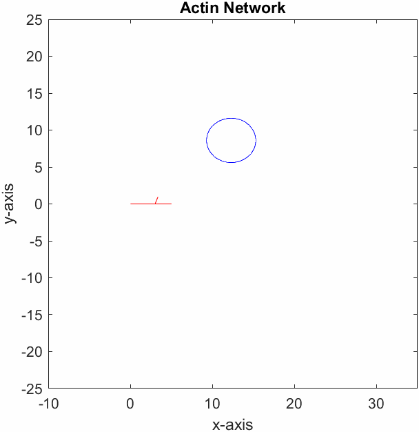

# Trade-offs in spatial coverage in stochastically growing actin cytoskeletal networks

**UCI MathBioU REU — Summer 2023** | Research project supervised by Prof. Christopher Miles

Stochastic simulation of actin filament network growth using the Gillespie algorithm. Models the competition between filament elongation and branching as a network navigates toward a target, with the broader goal of understanding whether real cells operate at or near optimal efficiency.

📊 [View final presentation](https://drive.google.com/file/d/1ivEPkW1X1apozp85oPecxz45zT0x3PYy/view?usp=sharing)

---

## Biological background

Actin is a vital cytoskeletal protein involved in cell motility, muscle contraction, and wound repair. At the leading edge of a migrating cell, actin networks grow by two competing processes:

- **Elongation** — actin monomers attach to the barbed end of a filament (facilitated by formin and profilin), extending the filament in its current direction
- **Branching** — the Arp2/3 complex attaches to an existing filament and nucleates a new filament at a 70° angle

These two processes compete for a shared pool of actin monomers, creating a fundamental trade-off. This project asks: **what combination of elongation and branching rates minimizes the time for an actin network to reach a target — and are real cells as efficient as they could be?**

---

## Simulation methods

### Gillespie algorithm
Rather than stepping through fixed time intervals (where a reaction may or may not occur), the Gillespie algorithm guarantees exactly one reaction per step and draws the waiting time from an exponential distribution based on the total reaction rate:

$$t \sim \text{Exp}(1/k), \quad k = \sum_{i=1}^{n} k_{ei} + \sum_{j=1}^{n} k_{bj}$$

This makes the simulation exact and continuous-time, with no discretization error.

### Two target models
| Model | Description |
|-------|-------------|
| **Single target** | One target placed at fixed radius from origin, position randomized each simulation |
| **Multiple targets** | Network must reach all targets — mimics spatial coverage of a region |

---

## File structure

```
├── actin_sim.m                          # Core simulation — one trial given k_e, k_b
├── multi_run.mlx                        # Parameter sweep across k_e / k_b combinations
├── gillespie_algorithm.mlx              # Standalone Gillespie exploration and validation
├── rates_vs_time.mlx                    # Rate vs. average time-to-target analysis
├── multiple_targets.mlx                 # Extension: network must reach all targets
├── kbfunc.m                             # Length-dependent branching rate function
├── calc_angle.m                         # Branch angle calculator (±70° from parent)
├── pick_dir.m                           # Random branch direction selector
└── actin_movie01-Aug-2023-20-15-48.gif  # Sample simulation animation
```

---

## Key results

### Optimal elongation/branching split
The simulation was run hundreds of times across a sweep of rate combinations (holding total rate constant at k = 10) to find the split that minimizes average time to target.

**Finding:** The optimal combination is approximately **75% elongation / 25% branching** (k_e ≈ 7.5, k_b ≈ 2.5). Pure elongation (no branching) is slow because a single filament is unlikely to point directly at a randomly placed target; pure branching creates a dense but spatially limited network that covers little ground.

### Target size shifts the optimum
When the target radius is varied, the optimal rate combination changes:
- **Larger targets** favor more elongation (~75% elongation optimal)
- **Smaller targets** favor more branching — spatial coverage matters more when precision is required

### Network geometry at different rate combinations
| Rates (k_e / k_b) | Network behavior |
|-------------------|-----------------|
| 9.5 / 0.5 | Sparse, long filaments — high spatial reach, low coverage |
| 8 / 2 | Balanced network — moderate reach and coverage |
| 5 / 5 | Dense, compact cluster — high coverage, low reach |

---

## Sample output



*One simulation trial. Each line segment represents a filament; branching events create new filaments at ±70° from the parent.*

---

## Future directions
- Map optimal rates across all combinations of target size and target distance (size vs. distance heatmap)
- Implement capping proteins to limit filament growth
- Constrain available helper protein (formin, Arp2/3) pools to reflect biological reality

---

## Team
- Adityakrishnan Radhakrishnan
- Masha Gorodetski

**PI:** Prof. Christopher Miles, Department of Mathematics, UC Irvine

---

## Acknowledgements
Research conducted as part of the [MathBioU REU](https://cellfate.uci.edu/mathbiou-math-explr-2023/) at UC Irvine, Summer 2023.
